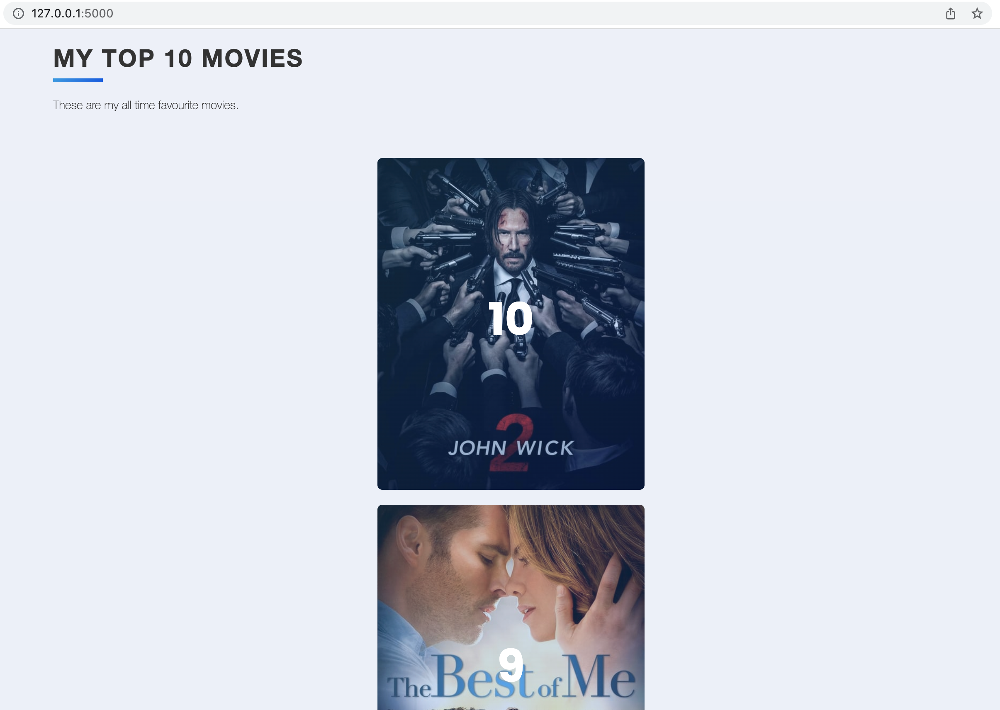
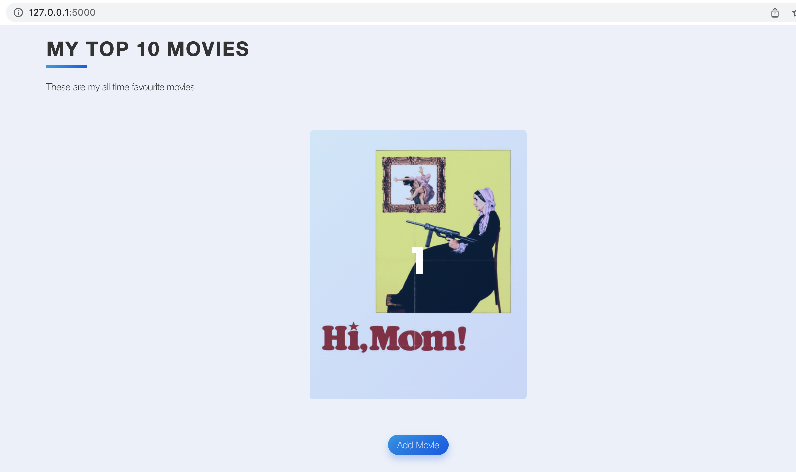
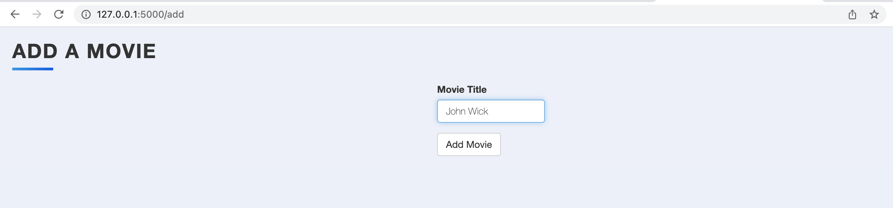
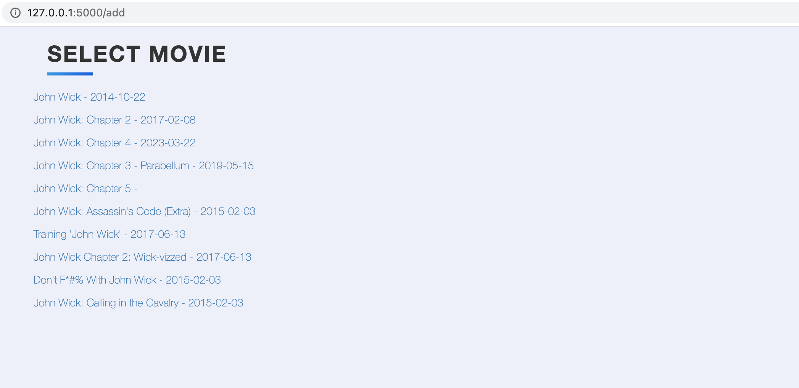
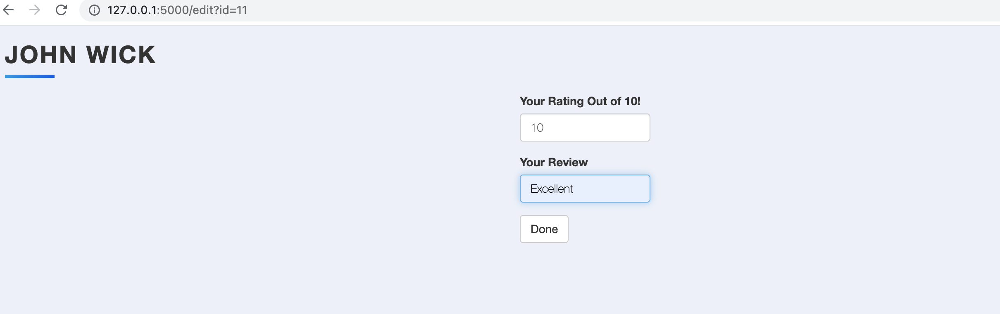
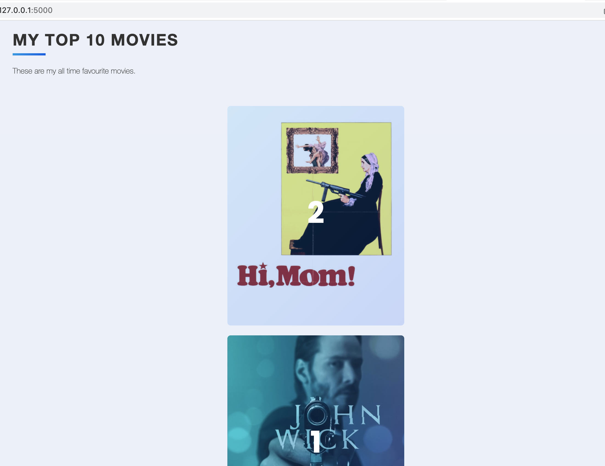
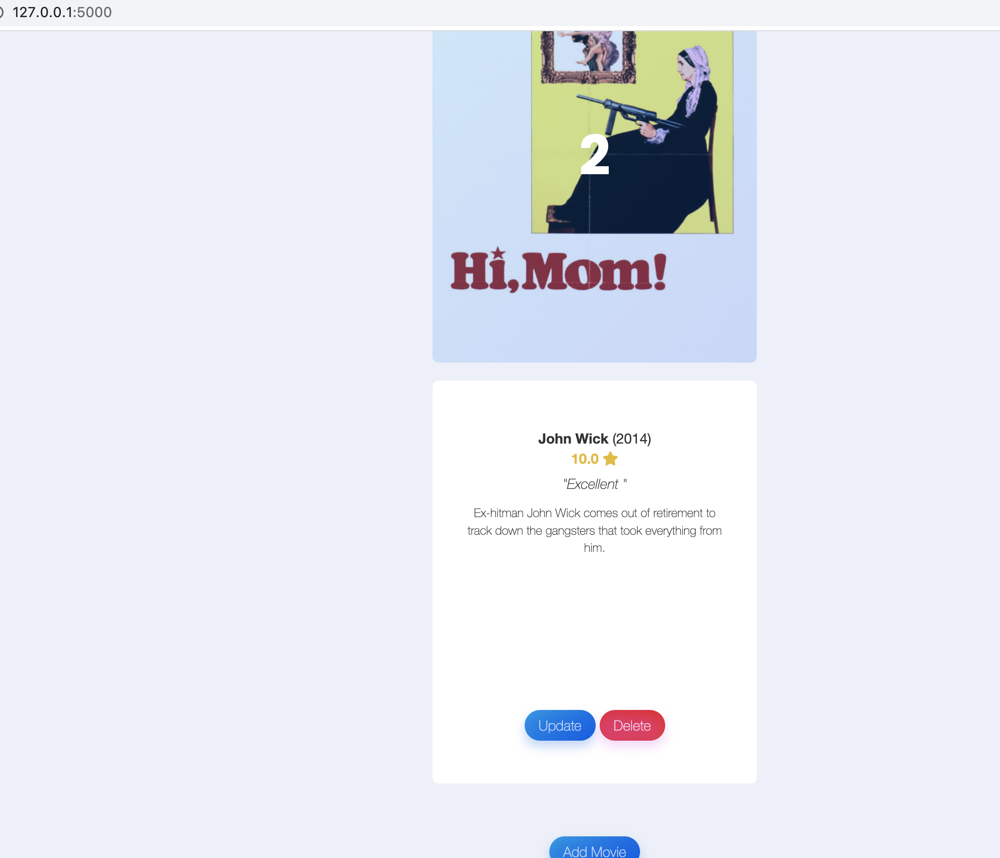

# My_top_10_movies

 

## Introduction
### In this repository we have created a wesite which uses:
* Flask_SQLAlchemy to work with a sqlite3 database.
* Python's resquests module to work with API's
* FlaskForms to create forms which can be filled by the users.
* Boostrap with the help of Jinja Templating
* WTForms to create quick flask form
* Html and CSS to create and style our website pages.
* Flask web framework to build our project
 

 

## Description
### **>** Here we have created a website which helps users to build their unique personal website which can store the top 10 favourite movies or more if needed as we are using a sqlite database.

 

## Simulation / Steps of how the website works

### **1** We start with one movie added to our database which shows on the homepage(/home) of our website.

 

### **2** The add movie button sends an APi request to retirive a set of movies which based on the title passed by the user.

 

### **3** Selecting a movie from the list creates a new movie_id for it in the database and ask us for our input next.

 

### **4** Fill the review form which uses the movie_id to add to our databse.

 

### **5** Finally we have the new movie displayed and added in order based on the rating provided by the user previously

 

### **6** Whenever we hower over our movie card the card displays information about the particular movie it represents and the rating and review can be edited or the entire card can be deleted from the database if the user wishes to click on the respective buttons.

